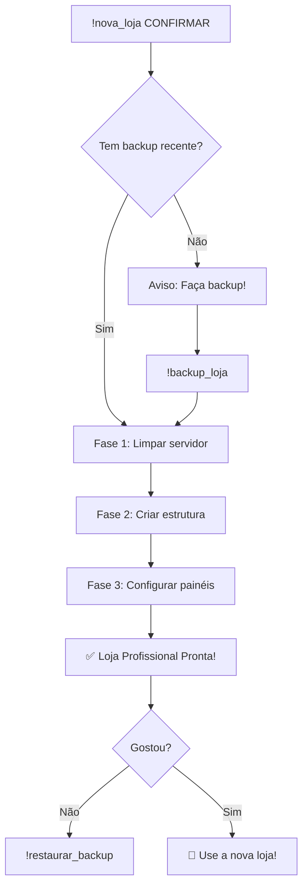

# 🎉 Comando !nova_loja Implementado!

## ✅ O que foi criado:

### 1. **Sistema Completo de Criação de Loja** (`loja_builder.py`)
- ✅ Limpa servidor (mantém cargos)
- ✅ Cria 5 categorias profissionais
- ✅ Cria 17+ canais otimizados
- ✅ Configura 6+ painéis automáticos
- ✅ Permissões configuradas automaticamente

### 2. **Comando no Bot** (`bot.py`)
- ✅ `!nova_loja CONFIRMAR` - Cria loja do zero
- ✅ Sistema de confirmação de segurança
- ✅ Verificação de backup recente
- ✅ Progresso em tempo real
- ✅ Logs detalhados

### 3. **Documentação Completa**
- ✅ `NOVA_LOJA_GUIDE.md` - Guia detalhado
- ✅ `README.md` atualizado
- ✅ Exemplos práticos de uso

## 🏗️ Estrutura da Nova Loja:

### 📢 INFORMAÇÕES (4 canais)
```
👋│boas-vindas      - Mensagem de boas-vindas profissional
📜│regras           - Regras formatadas
📢│anúncios         - Novidades
ℹ️│informações      - Info da loja
```

### 🛒 LOJA (4 canais)
```
🎮│contas-roblox    - Contas com botão de compra
💎│robux            - Venda de Robux
🎫│passes-e-itens   - Game passes
🔥│promoções        - Ofertas especiais
```

### 💰 ATENDIMENTO (3 canais)
```
📧│abrir-ticket     - Sistema de tickets (painel)
⭐│avaliações       - Feedbacks
❓│dúvidas-frequentes - FAQ completo
```

### 💬 COMUNIDADE (6 canais)
```
💭│chat-geral       - Chat livre
😂│memes            - Memes Roblox
📸│mídia            - Screenshots
🤝│parcerias        - Propostas
🎤│Conversa Geral   - Voz
🎮│Jogando Roblox   - Voz
```

### 🔧 STAFF - PRIVADA (3 canais)
```
📊│logs             - Logs do sistema
🤖│comandos         - Comandos admin
⚙️│configuração     - Config
```

## 🎨 Painéis Automáticos:

1. **👋 Boas-Vindas** - Mensagem profissional com links
2. **📜 Regras** - 6 regras formatadas + punições
3. **📧 Tickets** - Botão funcional de abrir ticket
4. **❓ FAQ** - 6 perguntas frequentes
5. **ℹ️ Info** - Sobre a loja, diferenciais, estatísticas
6. **🎮 Contas** - Instruções de compra

## 🚀 Como Usar:

### Passo 1: Fazer Backup (OBRIGATÓRIO!)
```bash
!backup_loja
```

### Passo 2: Criar Nova Loja
```bash
!nova_loja CONFIRMAR
```

### Passo 3: Se Não Gostar, Restaurar
```bash
!listar_backups
!restaurar_backup <arquivo> confirmar
```

## ⚠️ Avisos de Segurança:

### O comando VAI APAGAR:
- ❌ Todas as categorias
- ❌ Todos os canais (texto e voz)

### O comando VAI MANTER:
- ✅ Todos os cargos
- ✅ Todos os membros
- ✅ Configurações do servidor

### Proteções Implementadas:
- ✅ Requer "CONFIRMAR" em maiúsculas
- ✅ Avisa se não há backup recente
- ✅ Apenas administradores podem usar
- ✅ Logs de todas as operações
- ✅ Pode reverter com backup

## 💡 Fluxo Completo:



## 📊 Estatísticas da Criação:

Após executar `!nova_loja`:
- **Categorias:** 5 criadas
- **Canais:** 17+ criados
- **Painéis:** 6+ configurados
- **Tempo:** 2-5 minutos
- **Permissões:** Configuradas automaticamente

## 🎯 Design Profissional:

### Características:
- ✅ Visual atraente com emojis
- ✅ Cores consistentes nos embeds
- ✅ Organização clara por categorias
- ✅ Canais somente leitura onde necessário
- ✅ Área privada para staff
- ✅ Sistema de tickets integrado
- ✅ Painéis informativos completos

### Otimizado Para:
- 🎮 Vendas de Roblox
- 💬 Comunidade ativa
- 📧 Suporte eficiente
- 🔒 Segurança e organização

## 🔄 Exemplo Real de Uso:

```bash
# Segunda-feira: Servidor desorganizado
# Usuário: "Quero reorganizar tudo!"

!backup_loja
# ✅ Backup criado: backup_MeuServidor_20250101_100000.json

!nova_loja CONFIRMAR
# 🏗️ Criando nova loja...
# ✅ Loja criada com sucesso!

# Servidor agora está profissional!
# 5 categorias, 17+ canais, 6+ painéis

# Se não gostar:
!restaurar_backup backup_MeuServidor_20250101_100000.json confirmar
# ✅ Servidor restaurado!
```

## 📝 Próximos Passos Após Criar:

1. **Configurar IDs no .env:**
   ```env
   TICKET_CHANNEL_ID=<novo_id>
   LOG_CHANNEL_ID=<novo_id>
   ```

2. **Ajustar Permissões:**
   - Dar acesso staff à categoria 🔧 STAFF
   - Configurar cargos coloridos
   - Ajustar hierarquia

3. **Adicionar Conteúdo:**
   - Adicionar contas no painel web
   - Atualizar informações específicas
   - Personalizar mensagens

4. **Testar Sistema:**
   - Abrir um ticket de teste
   - Verificar todos os canais
   - Confirmar permissões

## 🎉 Resultado Final:

Você terá uma **LOJA PROFISSIONAL DE ROBLOX** completamente funcional com:

✅ Design moderno e atraente
✅ Organização impecável
✅ Sistema de tickets funcionando
✅ Painéis informativos
✅ Área de comunidade ativa
✅ Seção administrativa privada
✅ Pronta para receber clientes!

---

**🚀 Transforme seu Discord em uma Loja Profissional em Minutos!**

**⚠️ IMPORTANTE:** Sempre faça backup antes de usar `!nova_loja`!
